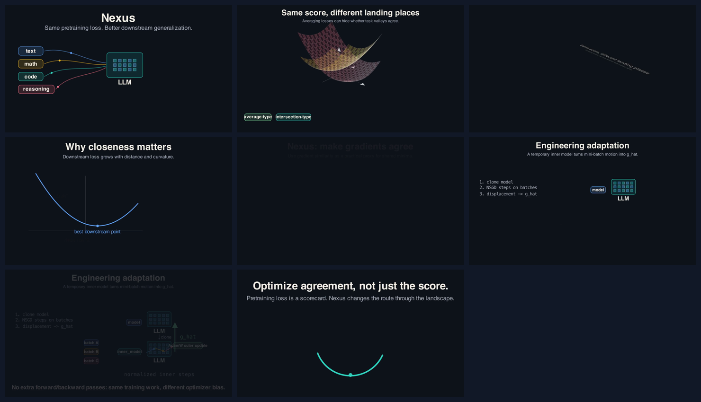

# Nexus Explainer H

This is the seed Content Maxxer job, moved in from Downloads.

Reference output:

- `reference/nexus_explainer_h.mp4`
- Duration: 56.25 seconds
- Resolution: 1920x1080
- Frame rate: 60 FPS
- Audio: none

Contact sheet:

## Why this is a good seed

The video already shows the core Content Maxxer style:

- one technical idea explained through a small set of visual beats;
- dark, high-contrast Manim composition;
- labels instead of dense paragraphs;
- mathematical shape language, including curves and 3D loss landscapes;
- a final takeaway that compresses the idea into one sentence.

The next improvement is to wrap this into a complete job pipeline: source notes, script, voiceover, captions, mobile crops, and final export variants.
